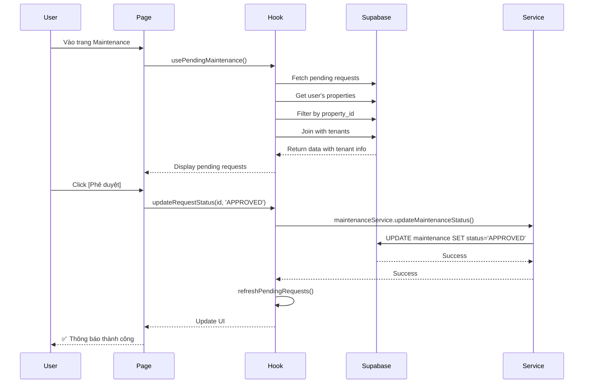

# Tính năng Hộp chờ Yêu cầu Bảo trì (Pending Maintenance Queue)

## 📋 Mô tả

Đây là tính năng hiển thị các yêu cầu bảo trì đang ở trạng thái **PENDING** (chờ phê duyệt) cho các bất động sản mà user hiện tại đang sở hữu.

## 🎯 Chức năng

### 1. **Hiển thị Realtime**
- Tự động cập nhật khi có yêu cầu bảo trì mới
- Realtime sync với database qua Supabase subscription
- Debounce 500ms để tránh quá nhiều API calls

### 2. **Thông tin hiển thị**

Mỗi yêu cầu bảo trì hiển thị:

#### Thông tin cơ bản:
- ✅ **Tiêu đề** (title)
- ✅ **Mô tả** (description)
- ✅ **Ghi chú** (notes) - nếu có
- ✅ **Độ ưu tiên** (priority): HIGH / MEDIUM / LOW
- ✅ **Loại bảo trì** (maintenance_type): BUILDING / ROOM / OTHER

#### Thông tin người báo cáo (từ bảng tenants):
- ✅ **Họ tên** (fullname)
- ✅ **Số điện thoại** (phone)
- Dựa trên `user_report_id` → join với `tenants.user_id`

#### Thông tin bất động sản:
- ✅ **Tên bất động sản** (properties.name)
- ✅ **Địa chỉ** (properties.address)

#### Thông tin phòng (nếu có):
- ✅ **Tên phòng** (rooms.name)

#### Thông tin khác:
- ✅ **Ngày tạo** (created_at)
- ✅ **Chi phí ước tính** (cost) - nếu có
- ✅ **Hình ảnh** (url_image) - có thể xem full size bằng click

### 3. **Các hành động (Actions)**

User có thể thực hiện 3 hành động với mỗi yêu cầu PENDING:

#### ✅ **APPROVED** - Phê duyệt
- Chuyển trạng thái sang APPROVED
- Yêu cầu sẽ chuyển vào Kanban board để xử lý

#### ❌ **REJECTED** - Từ chối
- Chuyển trạng thái sang REJECTED
- Yêu cầu sẽ không được xử lý

#### 🚫 **CANCELLED** - Hủy
- Chuyển trạng thái sang CANCELLED
- Yêu cầu bị hủy bỏ

Mỗi hành động đều có:
- Xác nhận trước khi thực hiện
- Thông báo kết quả (thành công/lỗi)
- Tự động refresh danh sách sau khi cập nhật

## 🔒 Bảo mật

### Application-level Security:
- Chỉ hiển thị yêu cầu bảo trì của **properties thuộc sở hữu của user hiện tại**
- Filter: `properties.owner_id = auth.uid()`
- Không cần RLS vì đã disable ở database level

## 📂 Cấu trúc Code

### Files tạo mới:

1. **`hooks/usePendingMaintenance.js`**
   - Hook quản lý state và logic cho pending requests
   - Realtime subscription riêng cho PENDING status
   - Function `updateRequestStatus()` để cập nhật trạng thái

2. **`components/PendingMaintenanceQueue.jsx`**
   - Component UI hiển thị danh sách pending requests
   - Responsive design với Tailwind CSS
   - Action buttons cho 3 loại status

### Files cập nhật:

1. **`pages/maintenance.jsx`**
   - Import `PendingMaintenanceQueue`
   - Đặt component phía trên Kanban board

## 🎨 UI/UX

### Layout:
```
┌─────────────────────────────────────────┐
│  🔔 Hộp chờ - Yêu cầu bảo trì            │
│  X yêu cầu đang chờ phê duyệt            │
├─────────────────────────────────────────┤
│  [Request 1]                             │
│  - Title, badges, description            │
│  - Grid info: tenant, property, room     │
│  - Notes, images                         │
│  - [✅ Phê duyệt] [❌ Từ chối] [🚫 Hủy]  │
├─────────────────────────────────────────┤
│  [Request 2]                             │
│  ...                                     │
└─────────────────────────────────────────┘
```

### Colors:
- **Header**: Yellow background (pending theme)
- **Priority badges**: Red (HIGH), Yellow (MEDIUM), Green (LOW)
- **Type badges**: Blue (BUILDING), Purple (ROOM), Gray (OTHER)
- **Buttons**: Green (APPROVED), Red (REJECTED), Gray (CANCELLED)

### States:
- **Loading**: Spinner hiển thị trong khi fetch data
- **Empty**: EmptyState component khi không có requests
- **Error**: Red alert box khi có lỗi

## 🔄 Flow hoạt động



## 🧪 Testing

### Test cases cần kiểm tra:

1. ✅ **Hiển thị đúng danh sách PENDING**
   - Chỉ hiển thị requests có status = 'PENDING'
   - Chỉ hiển thị requests của properties thuộc sở hữu

2. ✅ **Thông tin tenant hiển thị đúng**
   - Join với bảng tenants qua user_id
   - Hiển thị fullname và phone

3. ✅ **Realtime hoạt động**
   - Tạo request mới → Tự động hiển thị
   - Cập nhật status → Tự động cập nhật/ẩn

4. ✅ **Action buttons hoạt động**
   - APPROVED → Chuyển sang APPROVED
   - REJECTED → Chuyển sang REJECTED
   - CANCELLED → Chuyển sang CANCELLED

5. ✅ **Security**
   - User A không thấy requests của User B
   - Chỉ thấy requests của properties mình sở hữu

## 📝 Notes

- Component này hoạt động độc lập với Kanban board
- Sử dụng hook riêng để tránh conflict với useMaintenance
- Realtime channel riêng: `"pending-maintenance-changes"`
- Debounce 500ms cho realtime refetch để tối ưu performance
